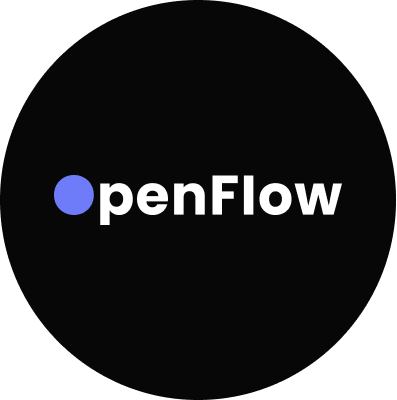
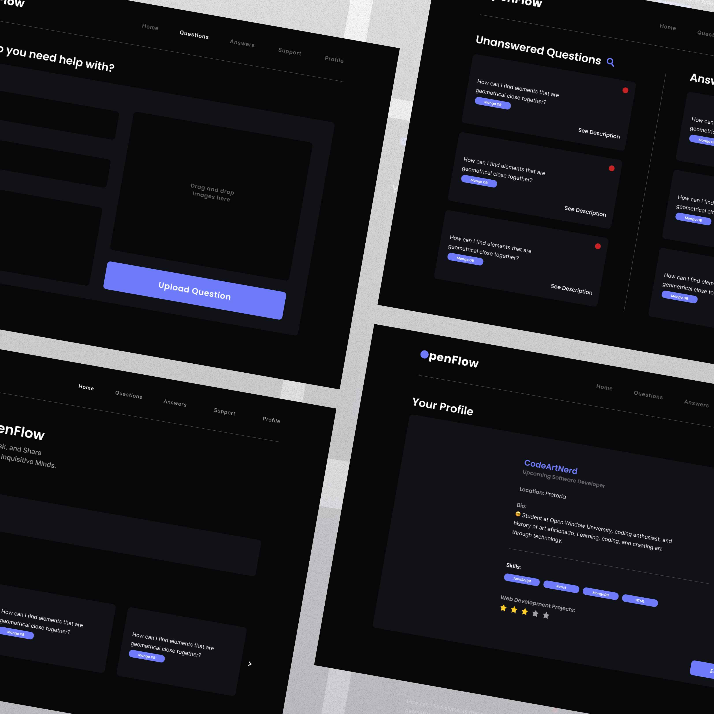
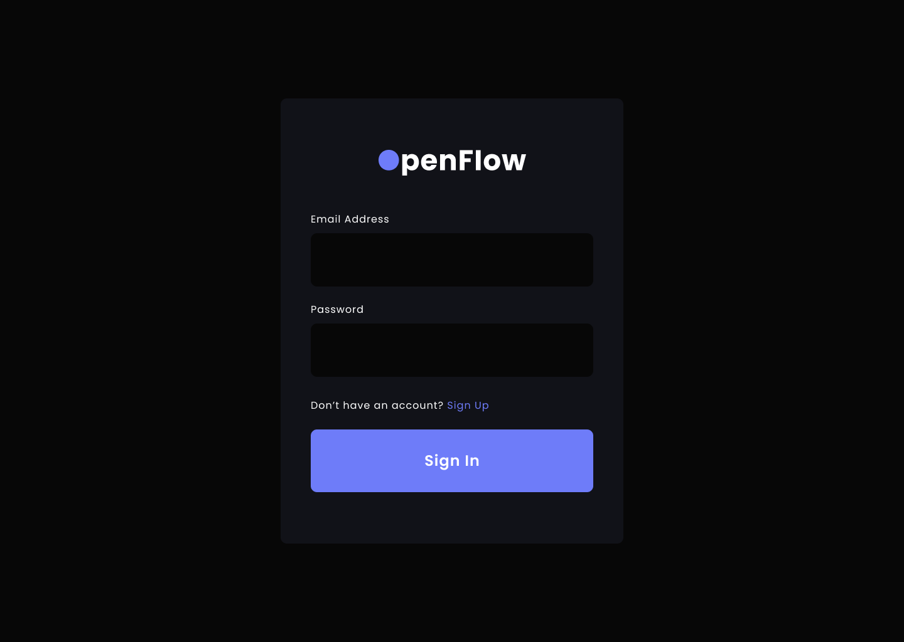
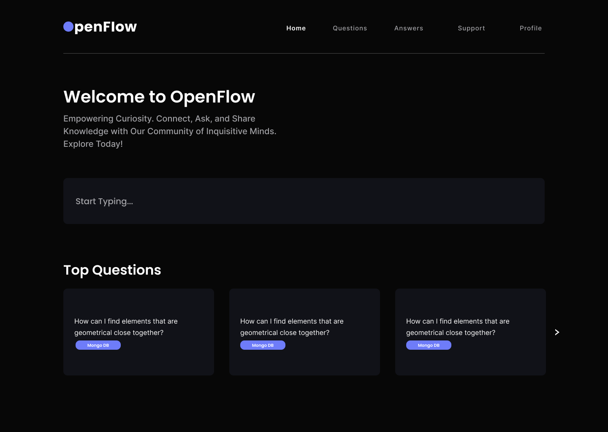
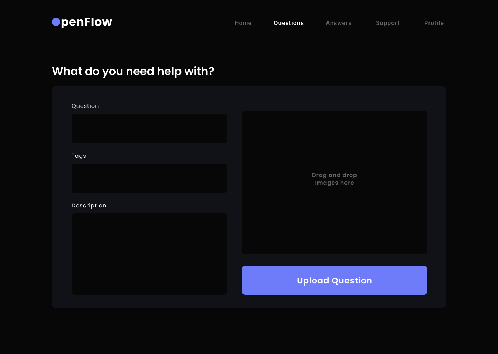
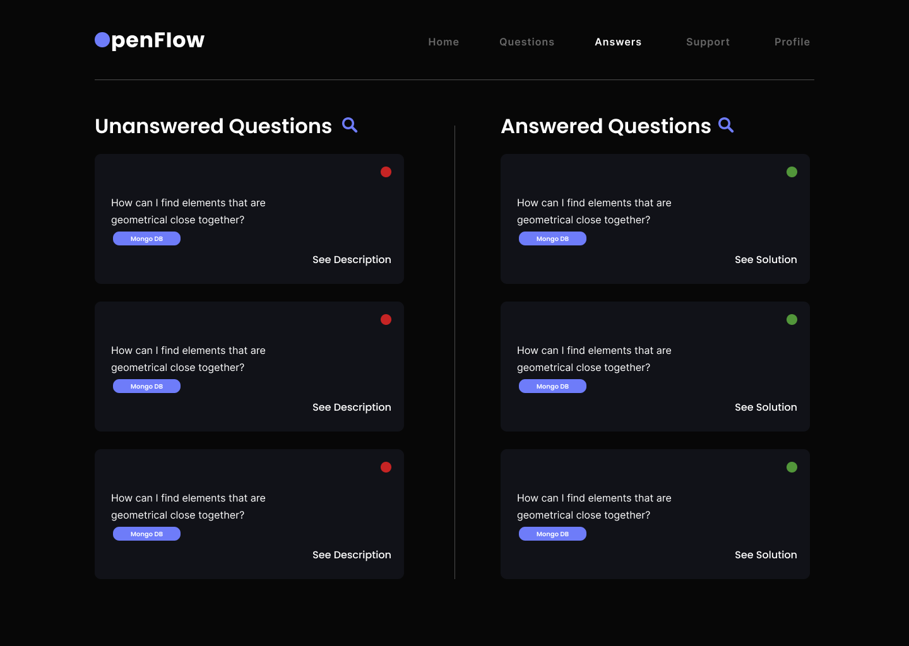
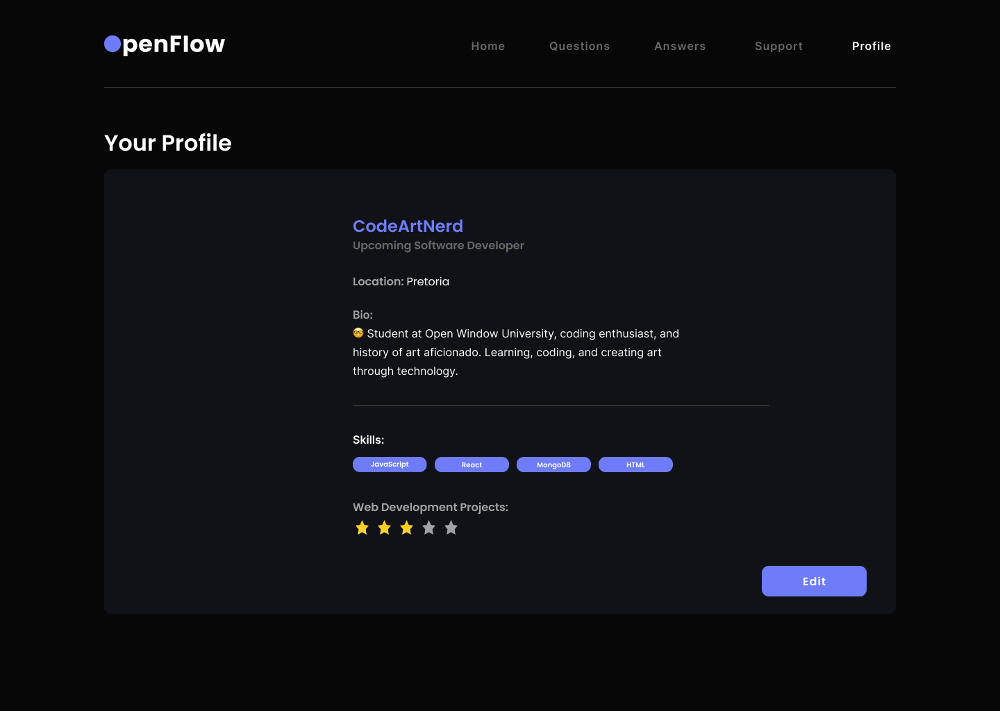

## 
Mareli Lourens, Tebogo Ramolobeng, Cameron Godwin, Tristan Storm   221119, 221244, 200109, 221195   Interactive Development 200 - Term 4

  

## 
Full Stack Web Application

## Table of Contents

* [About the Project](#about-the-project)
  * [Product mockup](#product-mockup)
  * [Project description](#project-description)
  * [Built With](#built-with)
* [Getting Started](#getting-started)
  * [Prerequisites](#prerequisites)
* [Features and Functionality](#features-and-functionality)
* [Concept Process](#concept-process)
   * [Ideation](#ideation)
   * [Wireframes](#wireframes)
* [Development Process](#development-process)
    * [Highlights](#highlights)
    * [Challenges](#challenges)
* [Future Implementation](#future-implementation)
* [Final Outcome](#final-outcome)
    * [Mockups](#mockup-video)
    * [Video Demonstration](#demonstration-video)
* [Conclusion](#conclusion)
* [Contact](#contact)

## About the project:

### Product mockup:

### Project description:
We embarked on a project to develop a full MERN stack application that's similar to the popular website, Stack Overflow . One particularly exciting aspect of this endeavor was the opportunity to delve into the code with the endpoint of creating this application for students from our own university. Given that Stack Overflow is already such a widely used website we made it our mission to make it as similar as possible but also "fixing" the pain points that we all had with it. This lead to a more UI focused website that is easier to maneuver.

### Built with:
For this project, we utilized React and Node.js, as well as advanced Javascript and Axios.

## Getting Started:

### Prerequisites:

* [Git](https://git-scm.com/downloads)
* [Node.js](https://nodejs.org/en)
* [NPM](https://www.npmjs.com/)

## Features and Functionality:

The web application is structured around six primary user-facing pages. The initial page serves as the home screen, showcasing the top questions that students have asked as well as a search bar where a user can search for a question and an answer. Next, on the questions page, the user will be able to "ask" a question about their code. They'll be able to type the question as well as select tags that are related to their question. Additionally the user will also be able to add extra information to help better describe their question. If the user then wants to they can add an image of their code before they upload the question. 

Moving on to the answers page, this is where users will be able to see questions that have already been answered as well as questions that are yet to be answered. They might also want to view more information around a specific question and move on to the answered questions page. However at the very beginning of the journey the user should first log in or sign up so that when they are logged in then they can see their profile on the profile page.

## Concept Process:

### Ideation:

In the initial brainstorming stage of the project, we took a look at Stack Overflow that was our main inspiration for this project and took the parts from that website that we liked and started forming wireframes around that. Next we looked through what we do not like about the website and we tried to rework those things to fit what we think would be a better output option. After we set up the wireframes we started with the initial setup of the codebase as well as the server side setup.

### Wireframes:

## Development Process

### Highlights

We found the experience of working on this project to be immensely rewarding. One of the key highlights us was learning how to work as a team to complete a website that is fully functional and deployment ready.

Another aspect of the project that we found particularly enjoyable was the chance to further improve our understanding of MERM stack development as well as React. As people who has worked with APIs in the past, we were already familiar with the basic concepts and principles involved. However, this project allowed us to delve deeper into the topic and gain a more nuanced understanding of how APIs work, how to use them effectively, and how to troubleshoot issues that might arise. By creating our own API it helped us gain further insight into how they are structured.

Overall, I feel that this project was an incredibly valuable learning experience for us. Not only did it allow us to expand our skill sets and gain a deeper understanding of key concepts and techniques, but it also gave us the opportunity to work on a real-world project with practical applications as a group. We look forward to building on what we've learned and continuing to grow and develop as programmers and developers in the future.

### Challenges

Over the duration of this project, we encountered several obstacles that stretched our skill sets and took us beyond our familiar territory. Among these challenges, a particularly noteworthy hurdle emerged in uploading images onto our API.

While the project undoubtedly presented substantial challenges, we view it as an invaluable learning journey. Navigating the complexities tied to the API and charts forced us to expand our developer capabilities and gain novel problem-solving insights. Reflecting on the project, a sense of accomplishment fills us as we consider what we managed to achieve. We eagerly anticipate applying these newfound lessons to upcoming ventures and obstacles.

## Future Implementation

Reflecting on our work on this project, there are several areas where we feel there is room for improvement and further development. One of the key areas where we would like to focus in the future is on stabilizing the code and improving consistency. While we were able to get the code working effectively for the purposes of this project, we feel that there is room for improvement in terms of streamlining the code, making it more efficient, and reducing redundancies. In addition, we would like to develop a more consistent coding style when it comes to working in a group, to make the code more accessible to others and easier to maintain over time.

Another area where we would like to expand and enhance the project is in making it more interactive and engaging for users. While the website is functional and provides a useful service, we believe that there is room to add more interactivity and animation to the site, in order to make it more visually appealing and engaging for users. This might involve developing new features and functionalities, such as interactive maps or dynamic data visualizations, or adding subtle animations and effects to various elements of the site.

## Final Outcome

### Mockup Video

https://github.com/MareliLourens/OpenFlow/assets/109971278/8f61f450-b44c-4f12-83a9-c5c9435bf0a6

### Demonstration Video

https://drive.google.com/file/d/12NNw567cPoNrMXdt6fgqneU2oYyVV-bE/view?usp=sharing

## Conclusion

This project has been an incredible learning experience for us, and we are truly grateful for the opportunity to work on it. Throughout the course of the project, we have learned so much, from technical skills to project management and collaboration.

Working on this project has allowed us to put into practice many of the concepts and techniques we have learned in our studies, and it has also challenged us to expand our knowledge and skills. From developing the initial idea to designing and implementing the project, we have gained a deeper understanding of the software development process and the importance of effective communication and teamwork.

We am particularly proud of the progress we have made in developing our programming skills. We have also gained a greater appreciation for the importance of testing and debugging, and how these skills are critical to developing high-quality software.

Overall, this project has been an incredibly fulfilling experience, and we are eager to continue working on it and implementing new features and improvements in the future. We believe that this project has not only helped us to develop our technical skills, but has also given us valuable experience working in a team environment and managing a project from start to finish. We am excited to take these skills and experiences with me as we move forward in our career, and we am confident that they will serve us well in whatever challenges lie ahead.

## Authors
Mareli Lourens - [Find me on Github](https://github.com/MareliLourens) 
Tebogo Ramolobeng - [Find me on Github](https://github.com/221244-Tebogo) 
Cameron Godwin - [Find me on Github](https://github.com/GodwinCameron) 
Tristan Storm - [Find me on Github](https://github.com/Tristanstormmm)

## Contact
Mareli Lourens - [Email](mailto:221119@virtualwindow.co.za) 
Tebogo Ramolobeng - [Email](mailto:221244@virtualwindow.co.za) 
Cameron Godwin - [Email](mailto:200109@virtualwindow.co.za) 
Tristan Storm - [Email](mailto:221195@virtualwindow.co.za)
 
Project Link - https://github.com/MareliLourens/OpenFlow.git

